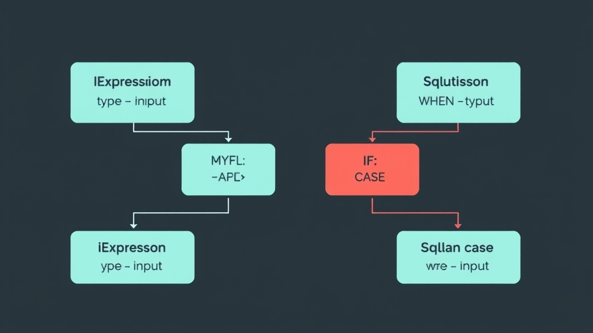

MySQL 和 SQLite 對同樣的功能常常用不同的 function name，像 MySQL 的 `IF()` 在 SQLite 要用 `CASE WHEN`。Laravel 10 新增的 Database Expression 可以優雅地處理這個問題。

## 以前的做法：用 when 判斷資料庫類型

MySQL 的 `IF` 在 SQLite 會噴 `no such function`，所以得這樣寫：

```php
namespace Tests\Feature;

use Illuminate\Database\MySqlConnection;
use Illuminate\Foundation\Testing\RefreshDatabase;
use Illuminate\Support\Facades\DB;
use Tests\TestCase;

class ExampleTest extends TestCase
{
    use RefreshDatabase;

    public function test_database_expression(): void
    {
        $isMySQL = is_a(DB::connection(), MySqlConnection::class);

        $result = DB::query()
            ->when($isMySQL, function ($query) {
                return $query->selectRaw('IF(10 > 1, 1, 0) AS value');
            })
            ->when(! $isMySQL, function ($query) {
                return $query->selectRaw('CASE WHEN 10 > 1 THEN 1 ELSE 0 END AS value');
            })
            ->first();

        self::assertEquals(1, $result->value);
    }
}
```

能用，但 code 又臭又長。

## 用 Expression 封裝跨資料庫差異

Laravel 10 的 `Expression` interface 有一個 `getValue(Grammar $grammar)` method，可以根據 Grammar 類型產生對應的 SQL。根據這個 [PR](https://github.com/laravel/framework/pull/44784) 的描述，這正是它設計的用途：



```php
namespace Tests\Feature;

use Illuminate\Contracts\Database\Query\Expression;
use Illuminate\Database\Grammar;
use Illuminate\Database\Query\Grammars\SQLiteGrammar;
use Illuminate\Foundation\Testing\RefreshDatabase;
use Illuminate\Support\Facades\DB;
use Tests\TestCase;

class ExampleTest extends TestCase
{
    use RefreshDatabase;

    public function test_database_expression(): void
    {
        $result = DB::query()
            ->select(new IfExpression('value', '10 > 1', 1, 0))
            ->first();

        self::assertEquals(1, $result->value);
    }
}

class IfExpression implements Expression
{
    public function __construct(
        private readonly string $alias,
        private readonly string $condition,
        private readonly mixed $true,
        private readonly mixed $false
    ) {
    }

    public function getValue(Grammar $grammar)
    {
        return match (get_class($grammar)) {
            SQLiteGrammar::class => "CASE WHEN $this->condition THEN $this->true ELSE $this->false END AS $this->alias",
            default => "IF($this->condition, $this->true, $this->false) AS $this->alias",
        };
    }
}
```

把跨資料庫的差異封裝進 Expression class，使用端只需要 `new IfExpression(...)` 就好，程式碼乾淨很多，也更容易重複使用。
