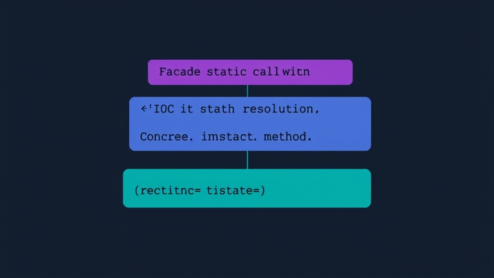

Continuing from [the previous post on Laravel Container](/post/how-to-use-laravel-container-to-register-third-party-package/), this post looks at the relationship between Container and Facade.

## bind vs singleton

First, prepare a `FakeApi` class:

```php
namespace App;

class FakeApi
{
    private string $token;

    public function __construct(string $token)
    {
        $this->token = $token;
    }

    public function getToken(): string
    {
        return $this->token;
    }
}
```

Register it in `AppServiceProvider` using `bind` with a random token:

```php
namespace App\Providers;

use App\FakeApi;
use Illuminate\Support\ServiceProvider;
use Illuminate\Support\Str;

class AppServiceProvider extends ServiceProvider
{
    public function register()
    {
        $this->app->bind(FakeApi::class, fn() => new FakeApi(Str::random()));
    }
}
```

Write a test that resolves `FakeApi` from the Container twice and compares the tokens:

```php
namespace Tests\Feature;

use App\FakeApi;
use Tests\TestCase;

class FacadeTest extends TestCase
{
    public function test_facade(): void
    {
        $fakeApi = app(FakeApi::class);
        $fakeApi2 = app(FakeApi::class);

        self::assertEquals($fakeApi->getToken(), $fakeApi2->getToken());
    }
}
```

The test fails because `bind` creates a new instance every time. Switching to `singleton` fixes it:

```php
$this->app->singleton(FakeApi::class, fn() => new FakeApi(Str::random()));
```

## Facade Is Just a Proxy for the Container

Create a Facade for `FakeApi`:

```php
namespace App\Facades;

use Illuminate\Support\Facades\Facade;

class FakeApi extends Facade
{
    protected static function getFacadeAccessor()
    {
        return \App\FakeApi::class;
    }
}
```

Test that the Facade and the instance resolved directly from the Container are the same:

```php
namespace Tests\Feature;

use App\Facades\FakeApi as FakeApiFacade;
use App\FakeApi;
use Tests\TestCase;

class FacadeTest extends TestCase
{
    public function test_facade(): void
    {
        $fakeApi = app(FakeApi::class);

        self::assertEquals($fakeApi->getToken(), FakeApiFacade::getToken());
    }
}
```

A Facade uses the key returned by `getFacadeAccessor` to resolve an instance from the Container, then forwards static method calls to instance methods.



## getFacadeAccessor Can Be Any String

For example, Laravel's built-in `DB` Facade returns the string `'db'` instead of a class name:

```php
namespace Illuminate\Support\Facades;

class DB extends Facade
{
    protected static function getFacadeAccessor()
    {
        return 'db';
    }
}
```

We can do the same by registering an alias in the Container:

```php
namespace App\Providers;

use App\FakeApi;
use Illuminate\Support\ServiceProvider;
use Illuminate\Support\Str;

class AppServiceProvider extends ServiceProvider
{
    public function register()
    {
        $this->app->singleton(FakeApi::class, fn() => new FakeApi(Str::random()));
        $this->app->singleton('fake-api', fn() => $this->app->make(FakeApi::class));
    }
}
```

```php
namespace App\Facades;

use Illuminate\Support\Facades\Facade;

class FakeApi extends Facade
{
    protected static function getFacadeAccessor()
    {
        return 'fake-api';
    }
}
```

The key registered in the Container is just a string (`FakeApi::class` is essentially a string too), so either a class name or a custom string works.

If you want to find where a built-in Laravel Facade is registered, just grep for it:

```bash
grep -rnw ./vendor -e "\$this->app->\(singleton\|bind\)('db'"
```
