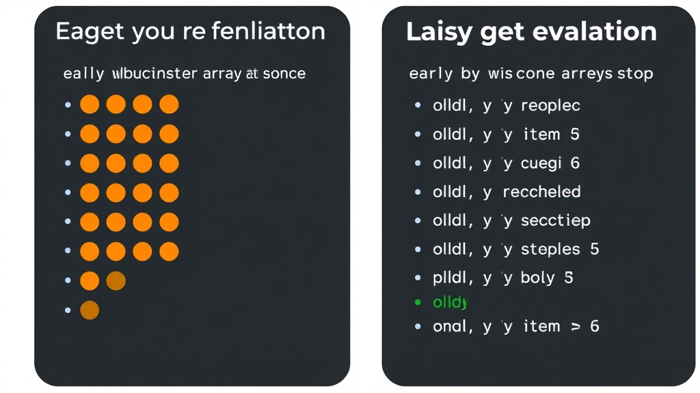

## The Code I Thought Would Work

After reading the docs, I knew LazyCollection with Generator enables lazy loading. So I passed a generator directly in, expecting the loop to stop once it found `$i > 5`:

```php
$this->assertEquals(6, LazyCollection::make($this->generator())->collapse()->first(function ($i) {
    return $i > 5;
}));
```

It didn't. The loop ran through all 9 iterations before stopping.

## Why

After digging into the LazyCollection source code, I figured it out. If the constructor receives something that isn't a `Closure`, it falls through to `getArrayableItems()`. Since Generator implements `Traversable`, it gets fully expanded by `iterator_to_array()` all at once:

```php
protected function getArrayableItems($items)
{
    // ...
    } elseif ($items instanceof Traversable) {
        return iterator_to_array($items);
    }
    // ...
}
```

The lazy loading effect is completely lost.



## The Correct Approach

Wrap it in a Closure so that LazyCollection receives "a function that produces a Generator" rather than an already-running Generator:

```php
$this->assertEquals(6, LazyCollection::make(function () {
    return $this->generator();
})->collapse()->first(function ($i) {
    return $i > 5;
}));
```

This way only the first iteration runs before stopping -- that's true lazy loading.

The distinction is whether you pass the Generator itself or a Closure that produces one.

## References

- [Laravel Docs: Lazy Collections](https://laravel.com/docs/collections#lazy-collections)
- [PHP Docs: Generators Overview](https://www.php.net/manual/en/language.generators.overview.php)
- [Laravel Source: LazyCollection](https://github.com/laravel/framework/blob/master/src/Illuminate/Support/LazyCollection.php)
- [PHP Docs: iterator_to_array](https://www.php.net/manual/en/function.iterator-to-array.php)
