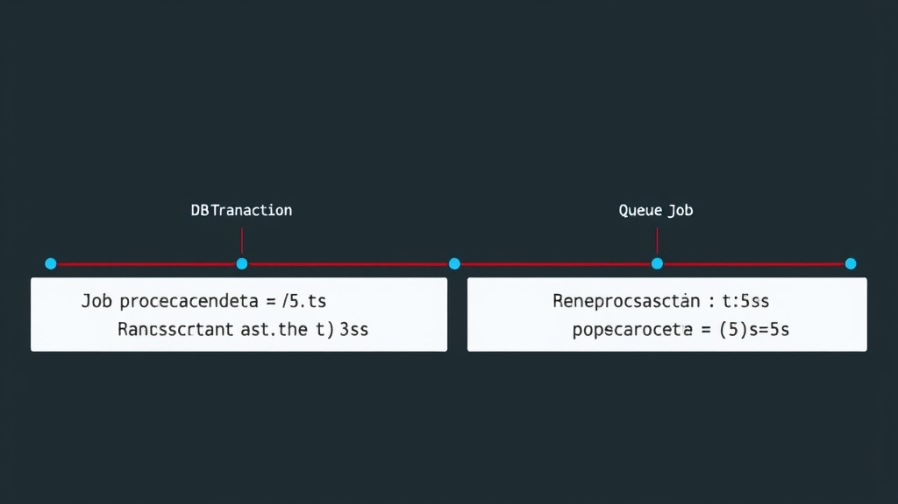

When dispatching a Job to a Queue inside a Transaction, the Job reads stale data.

## Why the Job Gets Old Data



Setup: Laravel connected to a real database, Queue Driver using Redis, one User already in the database, `php artisan queue:work` running.

In the following code, the Job is delayed by 3 seconds, but the Transaction doesn't commit until 5 seconds later:

```php
// tests/Feature/ExampleTest.php
namespace Tests\Feature;

use App\Jobs\EmailChanged;
use App\Models\User;
use Illuminate\Support\Facades\DB;
use Tests\TestCase;

class ExampleTest extends TestCase
{
    public function test_dispatch_user_email_changed(): void
    {
        DB::transaction(static function () {
            $user = User::findOrFail(1);
            $oldEmail = $user->email;
            $newEmail = 'test'.random_int(1, 100).'@gmail.com';
            $user->fill(['email' => $newEmail])->save();
            EmailChanged::dispatch($user, $oldEmail, $newEmail)
                ->delay(now()->addSeconds(3));
            sleep(5);
        });
    }
}
```

```php
// app/Jobs/EmailChanged.php
namespace App\Jobs;

use App\Models\User;
use Illuminate\Bus\Queueable;
use Illuminate\Contracts\Queue\ShouldQueue;
use Illuminate\Foundation\Bus\Dispatchable;
use Illuminate\Queue\InteractsWithQueue;
use Illuminate\Queue\SerializesModels;

class EmailChanged implements ShouldQueue
{
    use Dispatchable, InteractsWithQueue, Queueable, SerializesModels;
    private User $user;
    private string $oldEmail;
    private string $newEmail;
    public function __construct(User $user, string $oldEmail, string $newEmail)
    {
        $this->user = $user;
        $this->oldEmail = $oldEmail;
        $this->newEmail = $newEmail;
    }
    public function handle(): void
    {
        dump('old email: '.$this->oldEmail);
        dump('new email: '.$this->newEmail);
        dump('current email:'.$this->user->email);
    }
}
```

After running, `current email` still shows the old email. Because `SerializesModels` only stores the Model ID, the Job re-fetches the data from the database when it runs. But at that point the Transaction hasn't committed yet, so it reads the old value.

## Add afterCommit

Just add `afterCommit()` when dispatching. Laravel will wait until the Transaction commits before actually pushing the Job to the Queue:

```php
EmailChanged::dispatch($user, $oldEmail, $newEmail)
    ->delay(now()->addSeconds(3))
    ->afterCommit();
```

Now the Job reads the correct new data when it runs.
