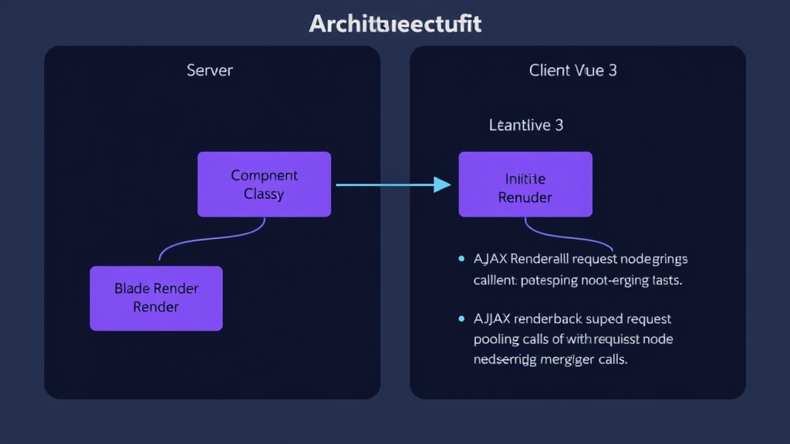

Livewire users know the joy: no APIs, no frontend/backend separation, just define state and methods in PHP, and your Blade template becomes a reactive UI. But Livewire's frontend is Alpine.js — limited in scope. If you want the Vue ecosystem (Vuetify, Pinia, Vue plugins), you have to switch to Inertia.js, which means `.vue` files, props passing, and client-side state management.

[LiVue](https://livue-laravel.com/) solves this: it brings Livewire's server-driven architecture to Vue 3. PHP handles state and logic, Vue 3 handles DOM reactivity, and you write Vue directives directly in Blade templates.

## How It Works

LiVue's request lifecycle has five steps:

1. A PHP Component class defines public properties (reactive state) and public methods (callable actions)
2. Blade templates mix Blade syntax with Vue directives (`v-click`, `v-model`, `v-if`, `v-for`)
3. Laravel renders complete HTML server-side; state is encrypted and HMAC-signed before embedding in the page
4. Vue 3 hydrates the DOM on the client
5. User interactions trigger AJAX calls; the server re-renders the component and diffs the DOM

Multiple server calls within the same tick are automatically pooled into a single HTTP request, reducing network round trips.



## Installation

```bash
composer require livue/livue
php artisan vendor:publish --tag=livue-config
```

Add to `resources/js/app.js`:

```javascript
import LiVue from 'livue';
LiVue.start();
```

You must add this alias to `vite.config.js`, otherwise Vue's template compiler won't be loaded:

```javascript
// vite.config.js
export default defineConfig({
    resolve: {
        alias: {
            'vue': 'vue/dist/vue.esm-bundler.js' // This line is critical
        }
    }
});
```

Add `@livueStyles` and `@livueHead` to your Blade layout:

```blade
<!DOCTYPE html>
<html>
<head>
    @livueStyles
    @livueHead
    @vite(['resources/js/app.js'])
</head>
<body>
    {!! $slot !!}  {{-- Use unescaped output since it contains rendered HTML --}}
</body>
</html>
```

If `inject_assets` is `true` in the config (default), these directives are optional.

## First Component: Counter

```bash
php artisan make:livue Counter
```

This generates two files:

`app/LiVue/Counter.php`:

```php
namespace App\LiVue;

use LiVue\Component;

class Counter extends Component
{
    public int $count = 0;

    public function increment(): void
    {
        $this->count++;
    }

    public function decrement(): void
    {
        $this->count--;
    }

    protected function render(): string
    {
        return 'livue.counter';
    }
}
```

`resources/views/livue/counter.blade.php`:

```blade
<div class="flex items-center gap-4">
    <button v-click:decrement> - </button>
    <span>@{{ count }}</span>
    <button v-click:increment> + </button>
</div>
```

Render it in any Blade view with `@livue('counter')` or `<livue:counter :count="5" />`.

The mental model is almost identical to Livewire: public properties are reactive state, public methods are frontend-callable actions. The difference is that templates use Vue directives instead of Alpine.

## Directive Quick Reference

LiVue provides a full set of custom directives covering most interaction scenarios:

### v-click: Call Server Methods

```blade
<button v-click:save>Save</button>
<button v-click:delete="{{ $item->id }}">Delete</button>
<button v-click:search.debounce.300ms>Search</button>
<button v-click:submit.throttle.500ms>Submit</button>
```

Supports `.prevent`, `.stop`, `.once`, `.debounce`, `.throttle` modifiers.

### v-model: Two-Way Binding

```blade
<input v-model="name" type="text" />
<input v-model.debounce.500ms="search" />  {{-- Syncs 500ms after typing --}}
<input v-model.blur="email" />              {{-- Syncs on blur --}}
```

### v-submit: Form Submission

```blade
<form v-submit:save>
    <input v-model="name" />
    <input v-model="email" />
    <button type="submit">Save</button>
</form>
```

### v-loading: AJAX Loading State

```blade
<div v-loading>Loading...</div>
<div v-loading:remove>Content shown after loading</div>
<span v-loading.action="'save'">Saving...</span>
<div v-loading.class="'opacity-50 pointer-events-none'">Content area</div>
```

### v-poll: Auto Polling

```blade
<div v-poll.5s="'refreshData'">
    Last updated: @{{ lastUpdated }}
</div>
```

Automatically pauses when the browser tab is not in the foreground.

### v-intersect: Viewport Trigger (Infinite Scroll)

```blade
<div v-intersect:loadMore>
    <span v-loading>Loading more...</span>
</div>
```

Other directives include `v-navigate` (SPA navigation), `v-dirty` (unsaved changes warning), `v-offline` (offline state), `v-sort` (drag-and-drop sorting), and `v-transition` (View Transitions API).

## Three Component Formats

### Class-Based (Default)

The Counter example above: separate PHP class + Blade template.

### Single File Component

PHP logic and template in the same `.blade.php` file:

```blade
<?php
use LiVue\Component;

new class extends Component {
    public int $count = 0;

    public function increment(): void
    {
        $this->count++;
    }
};
?>

<div>
    <span>@{{ count }}</span>
    <button v-click:increment>+1</button>
</div>
```

Generate with `php artisan make:livue MyComponent --single`. Best for simple components.

### Multi File Component

A folder containing separate PHP, Blade, JS, and CSS files:

```
resources/views/livue/my-widget/
├── my-widget.php           # anonymous class
├── my-widget.blade.php     # template
├── my-widget.js            # Vue Composition API (optional)
└── my-widget.css           # auto-scoped (optional)
```

CSS is automatically scoped using a `data-livue-scope-{name}` attribute. Best for complex components needing client-side JS logic.

## Page Components: Full-Page Routing

LiVue components can serve as route controllers:

```php
// routes/web.php
LiVue::route('/dashboard', App\LiVue\Dashboard::class)
    ->name('dashboard')
    ->middleware('auth');
```

```php
#[Layout('layouts.admin')]
#[Title('Dashboard')]
class Dashboard extends Component
{
    protected function head(): array
    {
        return [
            'description' => 'Admin dashboard',
            'og:title' => 'Dashboard',
        ];
    }
}
```

Supports `description`, `robots`, `og:*`, `twitter:*`, `canonical`, `json-ld` and other SEO-related tags.

## Lifecycle Hooks

| Hook | Timing |
|------|--------|
| `boot()` | Every request (initial + AJAX) |
| `mount(...$params)` | First render, receives props |
| `hydrate()` | AJAX request, after state restoration |
| `dehydrate()` | Before state serialization |
| `updating($key, $value)` | Before property update, can modify value |
| `updated($key, $value)` | After property update |

Property-specific versions are also available, e.g., `updatingEmail()`, `updatedEmail()`.

```php
public function mount(User $user): void
{
    $this->name = $user->name;
    $this->email = $user->email;
}

public function updatingEmail(string $value): string
{
    return strtolower(trim($value)); // Auto lowercase and trim
}
```

## PHP Attributes Overview

LiVue makes heavy use of PHP 8 Attributes for configuration:

```php
// Property
#[Validate('required|min:3')]   // Laravel validation rules
#[Url(as: 'q', history: true)]  // Sync to URL query string
#[Session(key: 'prefs')]        // Persist across pages
#[Guarded]                      // Encrypted, invisible to JS
#[Reactive]                     // Auto-update on parent re-render

// Method
#[Computed]                     // Cache computed results
#[Confirm('Are you sure?')]     // Show confirmation dialog
#[Renderless]                   // Skip HTML re-rendering
#[On('event-name')]             // Event listener

// Class
#[Island]                       // Isolated Vue app instance
#[Lazy]                         // Load when entering viewport
#[TabSync]                      // Sync state across tabs
```

`#[Url]` is especially useful — search page queries are reflected in the URL bar, so users can share search result URLs directly.

`#[Lazy]` combined with `placeholder()` enables skeleton loading:

```php
#[Lazy]
class HeavyChart extends Component
{
    public function placeholder(): string
    {
        return 'livue.chart-skeleton';
    }

    public function mount(): void
    {
        $this->data = DB::table('analytics')->get()->toArray();
    }
}
```

## Vue Ecosystem Integration

This is LiVue's biggest advantage over Livewire. Since it runs on Vue 3 under the hood, you can use Vue plugins directly:

```javascript
import LiVue from 'livue';
import { createVuetify } from 'vuetify';

const vuetify = createVuetify({
    theme: { defaultTheme: 'dark' }
});

LiVue.setup((app) => {
    app.use(vuetify);
    app.component('MyButton', MyButton);
    app.directive('focus', {
        mounted(el) { el.focus(); }
    });
});

LiVue.start();
```

Pinia is built-in — just `import { defineStore } from 'pinia'` and go.

Use `@script` in Blade templates for client-side logic:

```blade
@script
import { useCartStore } from './stores/cart';
const cart = useCartStore();
livue.watch('count', (val) => console.log('count changed:', val));
@endscript
```

## Streaming: Real-Time AI Output

LiVue has built-in streaming support using NDJSON format. This is handy when integrating LLM APIs:

```php
class AiChat extends Component
{
    use WithStreaming;

    public function ask(string $question): void
    {
        foreach ($stream as $chunk) {
            $this->stream(to: 'output', content: $chunk);
        }
    }
}
```

```blade
<div v-stream="'output'">Waiting for response...</div>
<button @click="livue.stream('ask', ['What is Vue?'])"
        :disabled="livue.streaming">
    Send
</button>
```

## Real-Time Communication: Laravel Echo Integration

```php
#[On('echo:orders,OrderCreated')]
public function handleNewOrder($event)
{
    $this->orders[] = $event;
}

#[On('echo-private:user.123,ProfileUpdated')]
public function handleProfileUpdate($event)
{
    $this->profile = $event['profile'];
}
```

Supports public, private, and presence channels.

## Comparison with Livewire and Inertia

| | LiVue | Livewire | Inertia.js |
|---|---|---|---|
| Frontend | Vue 3 | Alpine.js | Vue/React/Svelte |
| Templates | Blade + Vue directives | Blade + Alpine | Standalone .vue files |
| Requires API | No | No | No |
| Vue Ecosystem | Full support | No | Full support |
| State Management | Server-driven | Server-driven | Client-side |
| Streaming | Built-in | No | No |
| Islands Architecture | Supported | No | No |
| Tab Sync | Built-in | No | No |
| Maturity | New project | Mature | Mature |

Recommendations:

- Already using Vue ecosystem (Vuetify, Element Plus, etc.) but don't want full frontend/backend separation → **LiVue**
- Don't need Vue, want the simplest reactive UI → **Livewire**
- Frontend team develops independently, needs full SPA control → **Inertia.js**

LiVue is currently at v1.4.8 and is still early-stage software. It's worth trying on new projects, but factor in maturity before committing to it in production.
