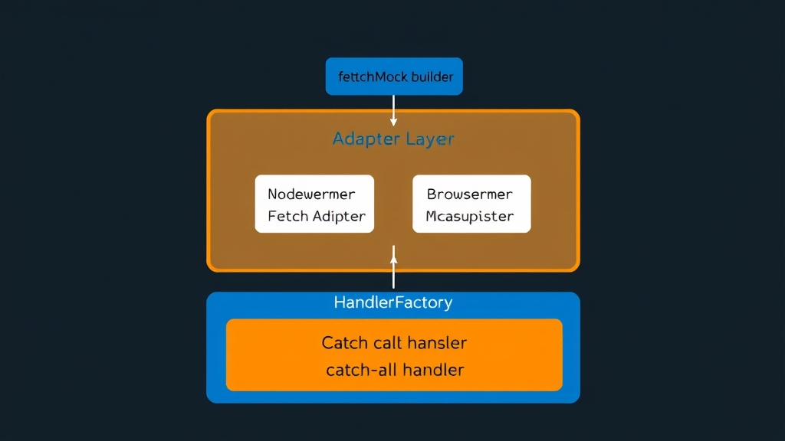

寫前端或 Node.js 測試時，mock HTTP 請求幾乎是必做的事。但光是選 mock 方案就有一堆：[MSW](https://mswjs.io)、[nock](https://github.com/nock/nock)、[fetch-mock](https://github.com/wheresrhys/fetch-mock)、jest-fetch-mock……每個的 API 風格、攔截層級、支援度都不一樣。如果你同時在寫 Cloudflare Workers 和 Node.js 專案，會發現兩邊的 mock 寫法完全不同，測試程式碼無法共用。

[msw-fetch-mock](https://github.com/recca0120/msw-fetch-mock) 要解決的就是這件事：用跟 undici `MockAgent` 和 Cloudflare Workers `fetchMock` 一樣的 API 風格，底層接 MSW 做攔截，讓你在任何環境都能用同一套寫法寫 mock。

## 為什麼現有方案不夠用？

先看一下目前主流的 6 套 HTTP mock 方案：

| 方案 | npm 週下載量 | 攔截層級 | Node native fetch | 瀏覽器 | 維護狀態 |
|------|-------------|---------|-------------------|--------|---------|
| MSW | ~10.5M | Service Worker / Node 內部 | ✅ | ✅ | 活躍 |
| nock | ~5.5M | Node `http` 模組 | ❌ | ❌ | 活躍 |
| fetch-mock | ~1.0M | 替換 `globalThis.fetch` | ✅ | ✅ | 活躍 |
| jest-fetch-mock | ~1.3M | 替換 `global.fetch` | ✅ | ❌ | 停止維護 |
| vitest-fetch-mock | ~240K | 替換 `globalThis.fetch` | ✅ | ❌ | 活躍 |
| undici MockAgent | 內建 | undici Dispatcher | ✅ | ❌ | Node 核心 |

每一套都有明顯的短板：

- **MSW** 功能最完整，但 API 很囉嗦。每個 endpoint 都要寫 `http.get(url, resolver)`，沒有 `times()`、`persist()`、`assertNoPendingInterceptors()` 這些測試必備功能。
- **nock** 是 Node.js 的老牌方案，API 簡潔好用，但**不支援 Node 18+ 的 native `fetch`**。因為 native fetch 走的是 undici，不經過 `http` 模組，nock 完全攔截不到。
- **fetch-mock** 直接替換 `globalThis.fetch`，能用但不是 network-level 攔截，行為可能跟 production 不同。
- **jest-fetch-mock** 已經 6 年沒更新，沒有 URL matching，只能按呼叫順序回應。
- **vitest-fetch-mock** 是 jest-fetch-mock 的 Vitest 版，一樣沒有 URL matching。
- **undici MockAgent** 是 Node 原生方案，但只能在 Node 用，不支援瀏覽器。

## msw-fetch-mock 的定位

msw-fetch-mock 不是從頭造一個 mock 引擎，而是站在 MSW 的肩膀上。它用 MSW 做 network-level 攔截（瀏覽器用 Service Worker、Node 用 `@mswjs/interceptors`），再包一層 undici 風格的 API。

架構分三層：

```
┌─────────────────────────────────────┐
│  FetchMock（使用者 API）              │
│  .get(origin).intercept().reply()   │
├─────────────────────────────────────┤
│  Adapter（環境適配）                  │
│  NodeMswAdapter / BrowserMswAdapter │
│  NativeFetchAdapter（無 MSW）        │
├─────────────────────────────────────┤
│  HandlerFactory（處理器工廠）          │
│  MSW v2 / MSW v1 Legacy / Native   │
└─────────────────────────────────────┘
```



重點是那個**單一 catch-all handler**。MSW 的標準用法是每個 endpoint 註冊一個 handler，但在瀏覽器環境這會造成 Service Worker 的 timing issue（每次 `worker.use()` 都要跟 SW 通訊）。msw-fetch-mock 只註冊一個 `http.all('*', ...)` catch-all，所有 matching 邏輯都在主線程裡跑，避免了 Service Worker 的來回延遲。

## API 快速上手

```bash
npm install msw-fetch-mock --save-dev
```

### 基本用法

```typescript
import { fetchMock } from 'msw-fetch-mock';

// 設定 lifecycle
beforeAll(() => fetchMock.activate({ onUnhandledRequest: 'error' }));
afterAll(() => fetchMock.deactivate());
afterEach(() => {
  fetchMock.assertNoPendingInterceptors(); // 沒用到的 mock = 測試寫錯
  fetchMock.reset();
});
```

### Chain Builder

```typescript
const base = 'https://api.example.com';

// GET 請求
fetchMock.get(base)
  .intercept({ path: '/users' })
  .reply(200, [{ id: 1, name: 'Alice' }]);

// POST + body matching
fetchMock.get(base)
  .intercept({
    path: '/users',
    method: 'POST',
    headers: { Authorization: /^Bearer / },
    body: (b) => JSON.parse(b).role === 'admin',
  })
  .reply(201, { id: 2 });

// 動態回應
fetchMock.get(base)
  .intercept({ path: '/echo', method: 'POST' })
  .reply(200, ({ body }) => JSON.parse(body));
```

### 控制行為

```typescript
// 只回應 3 次
fetchMock.get(base).intercept({ path: '/api' }).reply(200, data).times(3);

// 永久不消耗（例如 health check）
fetchMock.get(base).intercept({ path: '/health' }).reply(200, 'ok').persist();

// 模擬延遲
fetchMock.get(base).intercept({ path: '/slow' }).reply(200, data).delay(500);

// 模擬網路錯誤
fetchMock.get(base).intercept({ path: '/fail' }).replyWithError();
```

### Call History

```typescript
const last = fetchMock.calls.lastCall();
expect(last.method).toBe('POST');
expect(last.json()).toEqual({ name: 'Alice' });

// 篩選特定呼叫
fetchMock.calls.filterCalls({ method: 'POST', path: '/users' });
fetchMock.calls.called({ path: '/users' }); // boolean
```

### 網路連線控制

```typescript
fetchMock.disableNetConnect();              // 禁止所有未 mock 的請求
fetchMock.enableNetConnect('localhost');     // 允許 localhost
fetchMock.enableNetConnect(/\.internal$/);  // 允許符合 regex 的 host
```

## 6 套方案完整對照表

### 功能比較

| 功能 | msw-fetch-mock | MSW | nock | fetch-mock | jest-fetch-mock | undici MockAgent |
|------|:-:|:-:|:-:|:-:|:-:|:-:|
| URL pattern matching | ✅ | ✅ | ✅ | ✅ | ❌ | 部分 |
| Method matching | ✅ | ✅ | ✅ | ✅ | ❌ | ✅ |
| Header matching | ✅ | ✅ | ✅ | ✅ | ❌ | ✅ |
| Body matching | ✅ | ✅ | ✅ | ✅ | ❌ | ✅ |
| `times(n)` | ✅ | ❌ | ✅ | ✅ | ❌ | ✅ |
| `persist()` | ✅ | ❌ | ✅ | ❌ | ❌ | ✅ |
| `delay(ms)` | ✅ | ✅ | ✅ | ✅ | ❌ | ✅ |
| `assertNoPendingInterceptors()` | ✅ | ❌ | ✅ | ❌ | ❌ | ❌ |
| Call history + filtering | ✅ | ❌ | ❌ | ✅ | 部分 | ❌ |
| 模擬網路錯誤 | ✅ | ✅ | ✅ | ✅ | ❌ | ✅ |
| GraphQL 支援 | ❌ | ✅ | ❌ | ❌ | ❌ | ❌ |
| Record & Replay | ❌ | ❌ | ✅ | ❌ | ❌ | ❌ |

### 環境支援

| 環境 | msw-fetch-mock | MSW | nock | fetch-mock | jest-fetch-mock | undici MockAgent |
|------|:-:|:-:|:-:|:-:|:-:|:-:|
| Jest | ✅ | ✅ | ✅ | ✅ | ✅ | ✅ |
| Vitest | ✅ | ✅ | ✅ | ✅ | ❌ | ✅ |
| Node native fetch | ✅ | ✅ | ❌ | ✅ | ✅ | ✅ |
| Node http/axios | ✅ | ✅ | ✅ | ❌ | ❌ | ❌ |
| 瀏覽器 | ✅ | ✅ | ❌ | ✅ | ❌ | ❌ |
| Cloudflare Workers API 相容 | ✅ | ❌ | ❌ | ❌ | ❌ | ❌ |

### 攔截層級

攔截層級決定了 mock 的行為跟 production 的差距有多大：

| 方案 | 攔截層級 | 說明 |
|------|---------|------|
| MSW（瀏覽器） | Service Worker | 完全不 patch 任何東西，最接近 production |
| MSW（Node） | Node 內部 + undici | 擴展 `ClientRequest`，不是 monkey-patch |
| msw-fetch-mock | 同 MSW | 底層就是 MSW |
| nock | `http.request` | Monkey-patch Node http 模組 |
| fetch-mock | `globalThis.fetch` | 替換 fetch 函數 |
| jest-fetch-mock | `global.fetch` | 替換 fetch 為 jest.fn() |
| undici MockAgent | undici Dispatcher | 替換 undici 的 dispatcher |

## msw-fetch-mock 的真正優勢

msw-fetch-mock 相較於其他方案有三個具體優勢：

### 1. 一套 API，三個環境

undici `MockAgent`、Cloudflare Workers `fetchMock`、msw-fetch-mock 的 API 幾乎一樣：

```typescript
// undici MockAgent
const pool = mockAgent.get('https://api.example.com');
pool.intercept({ path: '/users', method: 'GET' }).reply(200, []);

// Cloudflare Workers fetchMock（cloudflare:test）
const pool = fetchMock.get('https://api.example.com');
pool.intercept({ path: '/users', method: 'GET' }).reply(200, []);

// msw-fetch-mock
const pool = fetchMock.get('https://api.example.com');
pool.intercept({ path: '/users', method: 'GET' }).reply(200, []);
```

如果你的程式碼同時跑在 Node.js 和 Cloudflare Workers，測試可以共用 mock 寫法，只改 import 就好。

### 2. MSW 的攔截品質 + undici 的 API 簡潔度

MSW 是目前攔截品質最高的方案（瀏覽器用 Service Worker、Node 用 `@mswjs/interceptors`），但它的 API 偏囉嗦：

```typescript
// 原生 MSW：每個 endpoint 一個 handler
server.use(
  http.get('https://api.example.com/users', () => {
    return HttpResponse.json([{ id: 1 }]);
  }),
  http.post('https://api.example.com/users', async ({ request }) => {
    const body = await request.json();
    return HttpResponse.json(body, { status: 201 });
  })
);

// msw-fetch-mock：chain builder，少寫很多
fetchMock.get('https://api.example.com')
  .intercept({ path: '/users' })
  .reply(200, [{ id: 1 }]);

fetchMock.get('https://api.example.com')
  .intercept({ path: '/users', method: 'POST' })
  .reply(201, ({ body }) => JSON.parse(body));
```

而且 MSW 缺的功能——`times()`、`persist()`、`assertNoPendingInterceptors()`、call history filtering——msw-fetch-mock 全部都有。

### 3. 可以跟既有的 MSW 共存

如果你的專案已經有一個 MSW server（例如 Storybook 或 integration test 用的），msw-fetch-mock 可以直接接上去：

```typescript
import { setupServer } from 'msw/node';
import { createFetchMock } from 'msw-fetch-mock';

const server = setupServer(/* 你既有的 handlers */);
const fetchMock = createFetchMock(server);
```

不需要拆掉既有的 MSW 設定，也不會衝突。

### 4. 不依賴 MSW 也能跑

如果你不想裝 MSW，msw-fetch-mock 有一個 `native` 模式，直接 patch `globalThis.fetch`：

```typescript
import { fetchMock } from 'msw-fetch-mock/native';
```

API 完全一樣，只是攔截層級從 network-level 降到 global patch。測試搬遷到 MSW 時只要改 import 路徑。

## 各方案適用場景

| 你的需求 | 推薦方案 |
|---------|---------|
| 跨 Node.js + Cloudflare Workers，想統一 mock API | **msw-fetch-mock** |
| 已經有 MSW 設定，但覺得 API 太囉嗦 | **msw-fetch-mock**（接既有 server） |
| 全端專案，瀏覽器 + Node 都要 mock | **MSW** 或 **msw-fetch-mock** |
| 只用 Node.js + axios/http | **nock** |
| 只用 Node.js + native fetch，不想裝 MSW | **undici MockAgent** |
| Vitest 簡單場景，不需要 URL matching | **vitest-fetch-mock** |
| Jest 簡單場景 | **fetch-mock**（不要用 jest-fetch-mock，已停止維護） |

msw-fetch-mock 的甜蜜點在：你想要 MSW 的攔截品質，但又想要 undici/Cloudflare 風格的簡潔 API，而且需要 `times()`、`persist()`、`assertNoPendingInterceptors()` 這些測試生命週期管理功能。

## 參考資源

- [msw-fetch-mock GitHub 儲存庫](https://github.com/recca0120/msw-fetch-mock) — 原始碼、API 文件與使用範例
- [MSW 官方文件](https://mswjs.io/docs/) — Mock Service Worker 完整使用指南
- [nock GitHub 儲存庫](https://github.com/nock/nock) — Node.js HTTP mocking 工具
- [undici MockAgent 文件](https://undici.nodejs.org/#/docs/api/MockAgent) — Node.js 原生 fetch mock 方案
- [Cloudflare Workers 測試文件](https://developers.cloudflare.com/workers/testing/vitest-integration/) — Cloudflare Workers 測試環境說明
