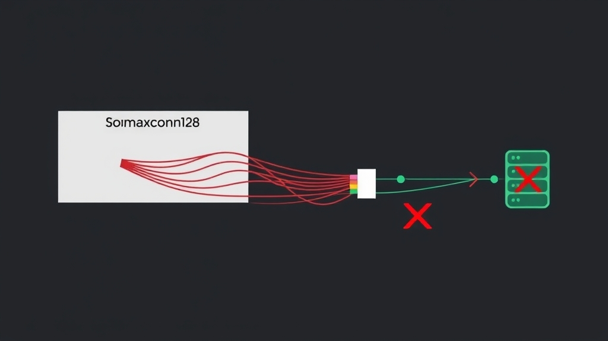

## Problem

When starting Redis, this warning appears:

```
The TCP backlog setting of 511 cannot be enforced because
/proc/sys/net/core/somaxconn is set to the lower value of 128
```

Redis defaults to a TCP backlog of 511, but the Linux kernel's `somaxconn` is only 128, so Redis can't use the queue length it wants. Under heavy connection load, this can cause dropped connections.



## Solution

Increase `somaxconn` with root privileges:

```bash
echo 512 > /proc/sys/net/core/somaxconn
```

This won't persist after a reboot. To make it permanent, add the setting to `/etc/sysctl.conf`:

```bash
net.core.somaxconn=512
```

Then reboot or run `sysctl -p` to apply.

## References

- [Redis documentation: kernel tuning recommendations](https://redis.io/docs/latest/operate/oss_and_stack/management/optimization/latency/)
- [Linux kernel docs: net.core.somaxconn](https://www.kernel.org/doc/html/latest/networking/ip-sysctl.html)
- [sysctl configuration guide (Arch Wiki)](https://wiki.archlinux.org/title/sysctl)
