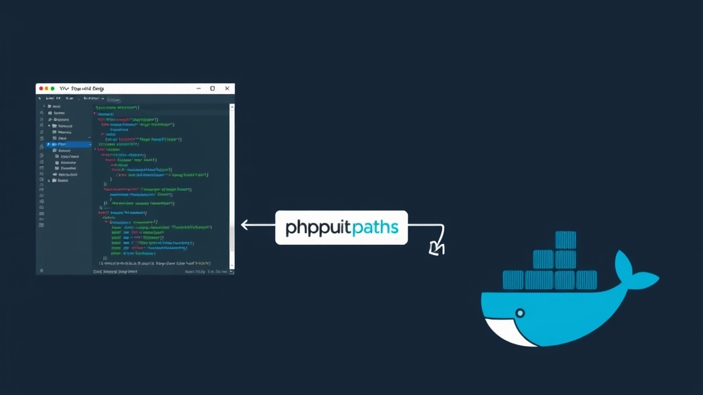

I built a VS Code extension called [PHPUnit & Pest Test Explorer](https://marketplace.visualstudio.com/items?itemName=recca0120.vscode-phpunit), which has accumulated over 260,000 installs. This article covers everything: features, configuration, Pest support, Docker integration, and Xdebug debugging.

## Why I Built This Extension

PHPUnit is the de facto testing framework in the PHP ecosystem, but running tests in VS Code has always been clunky. Either you open a terminal and type commands manually, or you use other extensions with limited functionality. What I wanted was: click a button to run a single test, click the stack trace to jump to the failing code, and make it work with Docker.

Couldn't find anything that checked all the boxes, so I built one.

## Basic Features

Once installed, the extension automatically detects `phpunit.xml` or `phpunit.xml.dist` in your project and lists all tests in VS Code's Test Explorer panel.

Supported version range:

- PHPUnit 7 – 12
- Pest 1 – 4

### Running Tests

Several ways to run tests:

- Click the play button next to a test in the Test Explorer panel
- Use the Run / Debug CodeLens above test methods in the editor
- Keyboard shortcuts:

| Shortcut | Action |
|----------|--------|
| `Cmd+T Cmd+T` | Run test at cursor |
| `Cmd+T Cmd+F` | Run all tests in current file |
| `Cmd+T Cmd+S` | Run all tests |
| `Cmd+T Cmd+L` | Rerun last test |

Replace `Cmd` with `Ctrl` on Windows / Linux.

### Test Output

Results are displayed in VS Code's native Test Results Panel. Three output presets are available:

- `collision` (default): Individual test results with syntax-highlighted PHP code snippets
- `progress`: Classic dot-progress bar
- `pretty`: One line per test without icons

```json
{
  "phpunit.output.preset": "collision"
}
```

Stack traces in error messages are clickable, jumping directly to the file and line. `dd()` output is syntax-highlighted too.

## Pest Support

If your `composer.json` includes `pestphp/pest`, the extension auto-detects it and switches to `vendor/bin/pest`. No configuration needed.

Manual override:

```json
{
  "phpunit.phpunit": "vendor/bin/pest"
}
```

Full dataset support including:

- `->with()` array datasets
- Chained `->with()` calls
- Generator-based data providers
- Loop-based yield data providers

Each dataset test case appears individually in Test Explorer and can be run or debugged independently.

## Docker Integration

In real-world development, PHP environments often run inside Docker containers. The extension uses `phpunit.command` and `phpunit.paths` to support various remote execution scenarios.

The core concept: `phpunit.command` defines how to execute the test command, and `phpunit.paths` maps local paths to container paths.



### Docker Compose

The most common scenario. Assuming your `docker-compose.yml` has an `app` service with code mounted at `/app`:

```json
{
  "phpunit.command": "docker compose exec -t app /bin/sh -c \"${php} ${phpargs} ${phpunit} ${phpunitargs}\"",
  "phpunit.paths": {
    "${workspaceFolder}": "/app"
  }
}
```

The `-t` flag allocates a pseudo-TTY for colored output.

### docker exec (Running Container)

If the container is already running:

```json
{
  "phpunit.command": "docker exec -t my_container /bin/sh -c \"${php} ${phpargs} ${phpunit} ${phpunitargs}\"",
  "phpunit.paths": {
    "${workspaceFolder}": "/app"
  }
}
```

### docker run (Ephemeral Container)

Disposable container that's removed after the run:

```json
{
  "phpunit.command": "docker run --rm -t -v ${PWD}:/app -w /app php:latest ${php} ${phpargs} ${phpunit} ${phpunitargs}",
  "phpunit.paths": {
    "${workspaceFolder}": "/app"
  }
}
```

### Multi-Workspace with Shared Container

For VS Code Multi-root Workspaces sharing a single Docker container, use `${workspaceFolderBasename}` to dynamically switch directories:

```json
{
  "phpunit.command": "docker exec -t vscode-phpunit /bin/sh -c \"cd /${workspaceFolderBasename} && ${php} ${phpargs} ${phpunit} ${phpunitargs}\"",
  "phpunit.paths": {
    "${workspaceFolder}": "/${workspaceFolderBasename}"
  }
}
```

Each workspace folder automatically maps to its corresponding directory in the container.

## Laravel Sail

Laravel Sail is essentially a Docker Compose wrapper. Configuration is similar with a few differences:

```json
{
  "phpunit.command": "docker compose exec -u sail laravel.test ${php} ${phpargs} ${phpunit} ${phpunitargs}",
  "phpunit.phpunit": "artisan test",
  "phpunit.paths": {
    "${workspaceFolder}": "/var/www/html"
  }
}
```

Key points:

- Use `-u sail` to specify the user; otherwise it runs as root and permissions get messy
- Container name is `laravel.test` (Sail's default)
- Set `phpunit.phpunit` to `artisan test` instead of `vendor/bin/phpunit` so Laravel's environment config (`.env.testing`) loads correctly
- Path maps to `/var/www/html`

## SSH Remote Execution

If your test environment is on a remote server:

```json
{
  "phpunit.command": "ssh user@host \"cd /app; ${php} ${phpargs} ${phpunit} ${phpunitargs}\"",
  "phpunit.paths": {
    "${workspaceFolder}": "/app"
  }
}
```

## DDEV

DDEV is the simplest — no path mapping needed:

```json
{
  "phpunit.command": "ddev exec ${php} ${phpargs} ${phpunit} ${phpunitargs}"
}
```

## WSL + Docker

Running Docker from WSL on Windows:

```json
{
  "phpunit.command": "docker exec -t my_container /bin/sh -c \"${php} ${phpargs} ${phpunit} ${phpunitargs}\"",
  "phpunit.paths": {
    "//wsl.localhost/Ubuntu/var/www/myproject": "/var/www/myproject"
  }
}
```

Use the `//wsl.localhost/` UNC path prefix.

## Xdebug Debugging

Click the Debug button in Test Explorer to trigger Xdebug step-through debugging. Setup:

### 1. Create launch.json

```json
{
  "version": "0.2.0",
  "configurations": [
    {
      "name": "Listen for Xdebug",
      "type": "php",
      "request": "launch",
      "port": 9003,
      "pathMappings": {
        "/app": "${workspaceFolder}"
      }
    }
  ]
}
```

For Docker environments, `pathMappings` should be the inverse of `phpunit.paths`.

### 2. Specify the Debugger Configuration

```json
{
  "phpunit.debuggerConfig": "Listen for Xdebug"
}
```

The name must exactly match the `name` in `launch.json`.

### 3. PHP-Side Configuration

Ensure `php.ini` or Docker environment variables include:

```ini
xdebug.mode = debug
xdebug.start_with_request = yes
xdebug.client_host = host.docker.internal  ; Only needed for Docker
xdebug.client_port = 9003
```

If using `start_with_request = trigger` instead of `yes`, pass `XDEBUG_TRIGGER` as an environment variable in your `phpunit.command`.

### Xdebug Port

Default `phpunit.xdebugPort` is `0` (random). To use a fixed port:

```json
{
  "phpunit.xdebugPort": 9003
}
```

## ParaTest Parallel Execution

Speed up tests with ParaTest:

```json
{
  "phpunit.phpunit": "vendor/bin/paratest"
}
```

## Other Useful Settings

### Auto-Save Before Running Tests

```json
{
  "phpunit.saveBeforeTest": true
}
```

### Custom Environment Variables

```json
{
  "phpunit.environment": {
    "APP_ENV": "testing",
    "DB_CONNECTION": "sqlite"
  }
}
```

### Extra PHPUnit Arguments

```json
{
  "phpunit.args": [
    "--configuration", "${workspaceFolder}/phpunit.xml.dist",
    "--no-coverage"
  ]
}
```

### Laravel Artisan (Non-Sail)

```json
{
  "phpunit.phpunit": "artisan test"
}
```

## Command Template Variables

Available variables for `phpunit.command`:

| Variable | Description |
|----------|-------------|
| `${php}` | PHP binary path |
| `${phpargs}` | PHP arguments |
| `${phpunit}` | PHPUnit/Pest binary path |
| `${phpunitargs}` | PHPUnit arguments (filter, configuration, etc.) |
| `${phpunitxml}` | Path to phpunit.xml |
| `${cwd}` | Current working directory |
| `${workspaceFolder}` | Full path to VS Code workspace folder |
| `${workspaceFolderBasename}` | Workspace folder name only (no path) |
| `${userHome}` | User home directory |
| `${pathSeparator}` | Path separator (`/` or `\`) |

## Auto-Detection and Reload

The extension automatically reloads the test list when:

- `phpunit.xml` or `phpunit.xml.dist` is modified
- `composer.lock` changes (possible PHPUnit/Pest version switch)
- Test files are added or removed

For manual reload, run `PHPUnit: Reload tests` from the Command Palette.

The extension activates when the workspace contains any `*.php` file. Projects without PHP files won't load the extension, so there's no performance impact.
